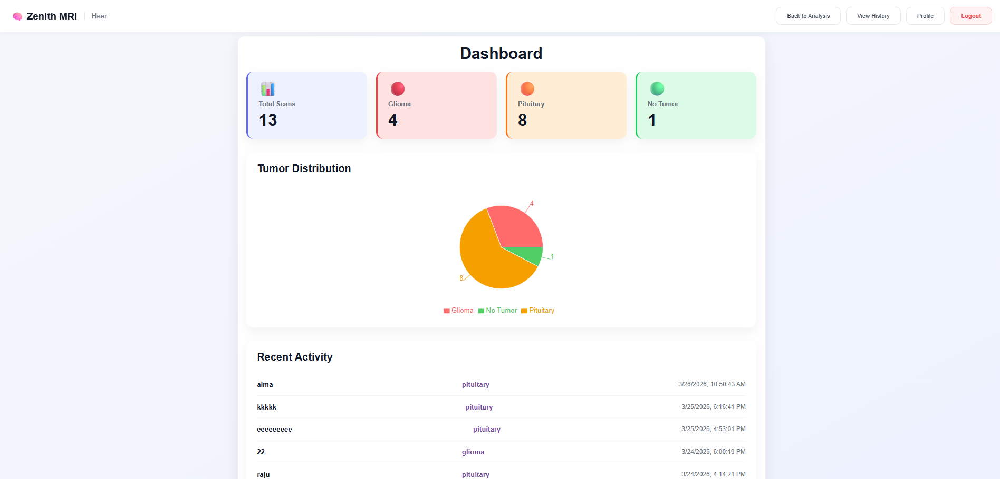
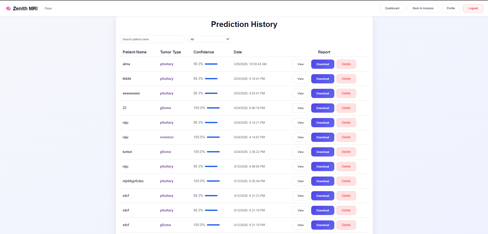
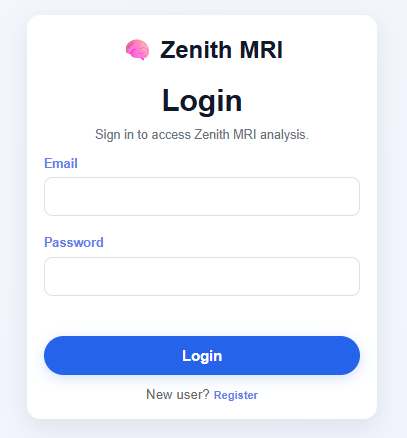
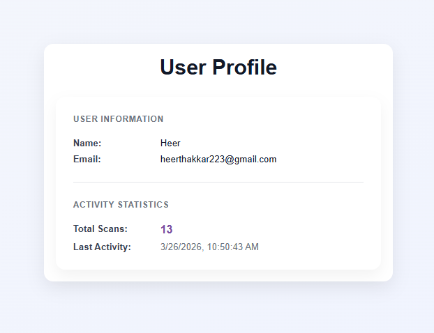
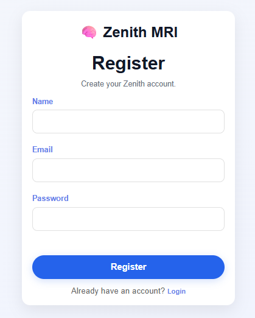
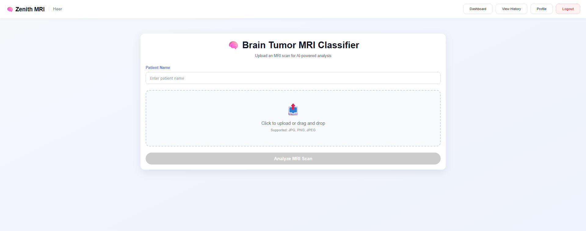

# 🧠 Zenith MRI — AI-Powered Brain Tumor Detection System

## 🚀 Overview

Zenith MRI is a full-stack web application that uses deep learning to analyze MRI scans and detect brain tumors. The system provides real-time predictions, heatmap visualization, and detailed reports to assist in medical analysis.

---

## 🎯 Features

### 🧠 AI-Based Detection

* Classifies MRI scans into:

  * Glioma
  * Pituitary
  * No Tumor
* Displays confidence score

### 📄 PDF Report Generation

* Download detailed reports
* Includes MRI image + prediction + heatmap

### 📊 Dashboard Analytics

* Total scans
* Tumor distribution
* Recent activity

### 🔐 Authentication System

* User login & registration
* Secure JWT-based authentication

### 📁 History Management

* View past reports
* Download reports
* Delete records

### 👤 Profile Page

* User details
* Total scans
* Activity tracking

### ⚡ Responsive UI

* Works on desktop & mobile
* Modern SaaS-style design

---

## 🛠 Tech Stack

### Frontend

* React + TypeScript
* CSS (custom styling)

### Backend

* Node.js + Express

### Database

* MongoDB

### AI Model

* Convolutional Neural Network (CNN)

### Other Tools

* jsPDF (PDF generation)
* JWT (Authentication)

---

## ⚙️ Installation

### 1. Clone Repository

```bash
git clone https://github.com/your-username/zenith-mri.git
cd zenith-mri
```

### 2. Install Frontend

```bash
cd mri-react
npm install
npm run dev
```

### 3. Install Backend

```bash
cd backend
npm install
node server.js
```

### 4. Run model

```bash
python main.py
```

---

## 🌐 API Endpoints

* POST `/api/predict` → Analyze MRI
* GET `/api/history` → Fetch history
* DELETE `/api/history/:id` → Delete record
* POST `/api/auth/login` → Login
* POST `/api/auth/register` → Register

---

## 📸 Screenshots

### Dashboard


### History 


### Login 


### Profile


### Register 


### Analysis 


---

## 🎓 Use Case

This project can be used for:

* Medical AI research
* Educational purposes
* Demonstrating full-stack + AI integration

---

## 📌 Future Improvements

* Real-time model improvement
* Doctor dashboard
* Cloud deployment
* Advanced analytics

---

## 👨‍💻 Author

Heer Thakkar

---

## ⭐ Conclusion

Zenith MRI demonstrates how AI can be integrated with modern web technologies to build impactful healthcare solutions.
